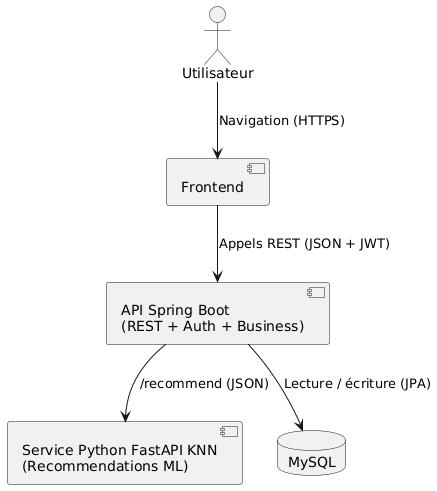
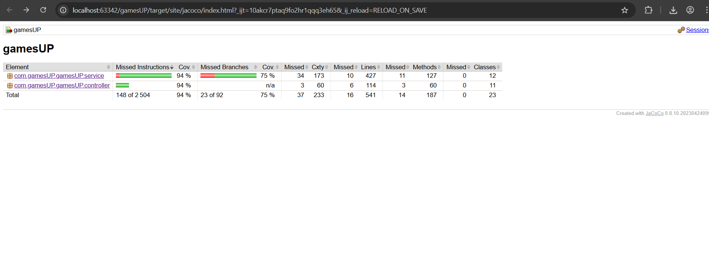
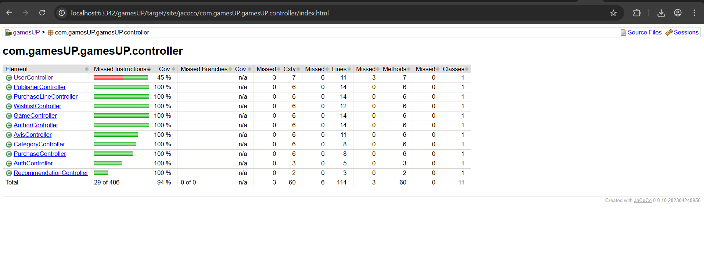

# Documentation GameUp

## 1-  Diagramme d'architecture

## 2-  Diagramme de classes

## 4-  Diagramme de composant

## 5-  Diagramme de sequence

* Diagramme de sequence general

* Diagramme de sequence avec l'api python

## 6-  Explications sur le respect des principes SOLID et les bonnes pratiques

### Mise en place du système de recommandation dans GameUp

#### 1. Fichiers référencés et leur rôle

| Fichier / Dossier                                      | Rôle                                                                                      |
|--------------------------------------------------------|-------------------------------------------------------------------------------------------|
| `gamesUP/`                                             | Application Spring Boot (Java, Maven).                                                    |
| `gamesUP/pom.xml`                                      | Gestion des dépendances et build Maven.                                                   |
| `gamesUP/src/main/java/com/`                           | Code source Java (entités, repositories, services, controllers).                         |
| `gamesUP/src/test/`                                    | Tests unitaires Java et ressources de test.                                              |
| `gamesUP/target/`                                      | Artefacts buildés (`gamesUP-0.0.1-SNAPSHOT.jar`) et rapports de couverture.             |
| `CodeApiPython/`                                       | Service Python de recommandation (module KNN).                                           |
| `CodeApiPython/recommendation.py`                      | Logique principale de génération des recommandations.                                    |
| `CodeApiPython/main.py`                                | Point d'entrée (API REST ou CLI selon implémentation).                                   |
| `CodeApiPython/data_loader.py`, `CodeApiPython/models.py` | Chargement des données et schémas utilisés par le modèle.                                |
| `CodeApiPython/data/data.csv`                      | Jeu de données d'entraînement pour le modèle KNN.                                        |
| `Games Up/ANNEXES/Doc.`                                    | Document d'explication et intégration .                               |

---

#### 2. Explication du fonctionnement

1. Collecte et gestion des données
    - Les entités Java (dans `gamesUP/src/main/java/com/...`) modélisent la BD.
    - Les repositories Spring Data exposent les interactions (achats, avis).
    - Les interactions utilisées pour la reco peuvent être exportées en CSV/JSON ou lues directement depuis la BD.

2. Entraînement et service Python
    - `CodeApiPython/recommendation.py` utilise `training_data.csv` et les utilitaires (`data_loader.py`, `models.py`) pour entraîner/charger le modèle KNN.
    - `CodeApiPython/main.py` peut exposer une API (FastAPI/Flask) ou fournir une interface CLI.

3. Appel du moteur de recommandation depuis Java
    - Option recommandée : exposer `CodeApiPython` via HTTP (FastAPI + Uvicorn) et appeler depuis Java via `RestTemplate` ou `WebClient`.
    - Alternative simple : exécuter `python main.py --userId X` en subprocess (moins scalable).
    - Option asynchrone : message queue (RabbitMQ/Kafka) si besoin de découplage fort.

4. Retour des recommandations
    - Le service Python renvoie une liste de `game_id`.
    - Java récupère les détails via `GameRepository` et renvoie des DTOs via un endpoint REST (`/api/recommendations/{userId}`).

---

## 3. Bonnes et mauvaises pratiques

### Bonnes pratiques
- Architecture en couches : entités, repositories, services, controllers.
- Abstraction de l'appel Python derrière une interface Java (`RecommendationService`).
- Containeriser `CodeApiPython` et versionner `requirements.txt`.
- Ajouter tests unitaires Python et tests d'intégration Java (mock de l'API).
- Documenter l'API Python (OpenAPI via FastAPI).

### Points d'amélioration / Risques
- Couplage si Java lance Python en subprocess. Utiliser HTTP pour découpler.
- Versionner uniquement des données anonymisées.
- Gérer erreurs réseau et timeout côté Java lors des appels au service Python.
- Sécuriser l'endpoint de recommandation (authentification, rate limiting).

---

## 4. Respect des principes SOLID

| Principe | Respecté ? | Explication |
|----------|------------|-------------|
| S (Single Responsibility) | ✅ | Séparation entités / services / controllers dans `gamesUP`. |
| O (Open/Closed) | 🟡 | Services extensibles ; encapsuler la reco pour éviter modifications directes. |
| L (Liskov) | ✅ | Interfaces repository/services remplacables. |
| I (Interface Segregation) | ✅ | Controllers et services spécifiques. |
| D (Dependency Inversion) | ✅ | Créer `RecommendationService` (interface) et implémentation HTTP pour respecter D. |

---

## Résumé

Le dépôt contient déjà l'application Spring Boot (`gamesUP`) et un module Python (`CodeApiPython`). Recommander de découpler via une API REST exposée par `CodeApiPython`, d'abstraire l'appel dans une interface Java `RecommendationService`, de containeriser les deux services et d'ajouter des tests d'intégration et de sécurité pour production.

## 7-  Les rapports de couverture de tests

* Rapport de couverture des tests sur les services
  

* Rapport de couverture des tests sur les controllers
  